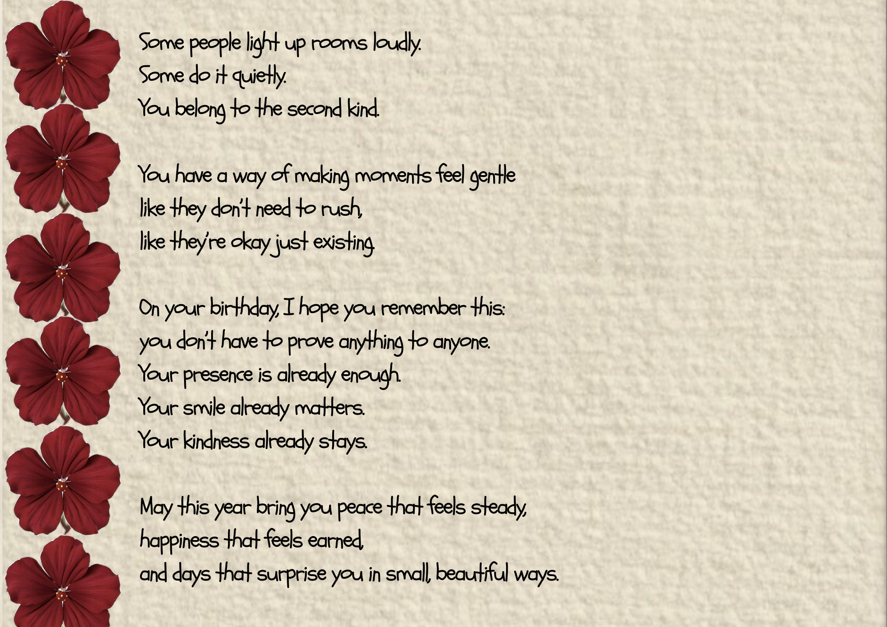
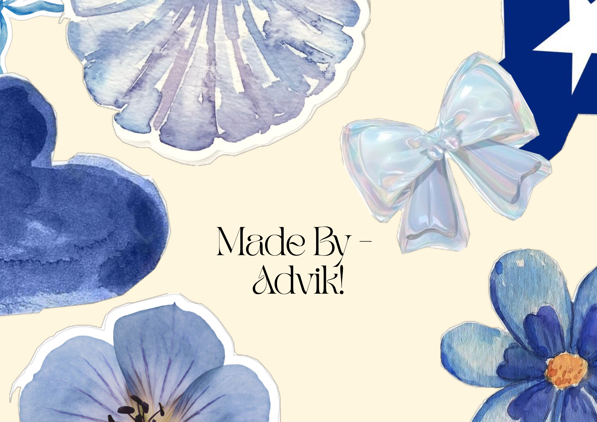

<html lang="en">
<head>
<meta charset="UTF-8">
<title>For Sanika 🥰</title>

<link href="https://fonts.googleapis.com/css2?family=Manufacturing+Consent&display=swap" rel="stylesheet">

</head>

<body>

<!-- 📸 CAMERA -->

  

    

    
3

  

<!-- SLIDES -->

<button id="nextBtn" class="next-btn">➜</button>

</body>
</html>
